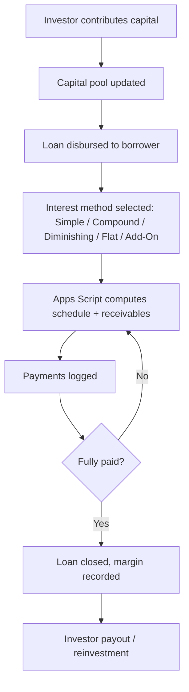

# Lending Management System

A Google Sheets + Apps Script lending management system for borrowers, loans, payments, capital, expenses, and receivables — plus a self-contained HTML tracker demo (based on the LendTrack Pro pattern) for a lighter-weight, no-spreadsheet-required option.

> **Status:** Demo/framework repository. This is a sanitized version of a real system pattern I build and use for lending businesses — no real borrower, investor, or financial data is included. See [Disclaimer](#disclaimer).

---

## Project Overview

Small lending businesses (personal lending, "5-6" style microlending, informal investor-funded lending) are usually run out of a notebook or a messy spreadsheet, with interest computed by hand and no clear picture of capital vs. receivables. This repo gives two ways to run it properly: a Google Sheets + Apps Script backend for teams that want everything in Workspace, and a self-contained HTML tracker (`demo/index.html`) for a fast, mobile-friendly single-user tool.

## Business Problem

- Interest is calculated inconsistently, and the computation method used isn't recorded per loan
- No single view of total capital deployed, expected receivables, and actual collections
- Multiple investors funding the same lending pool have no per-investor breakdown
- Expenses (collection costs, admin costs) aren't tracked against the lending business's actual margin

## Solution

- **Borrowers / Loans / Payments** sheets track every loan from disbursement to payoff
- Apps Script computes interest using the selected method per loan (see below) and keeps a running receivables balance
- **Investors / Capital** sheets track how much capital each investor has contributed and their share of the pool
- **Expenses** sheet tracks operating costs separately from loan principal/interest
- `demo/index.html` is a self-contained, mobile-responsive HTML tracker with the same five interest methods, Chart.js visualizations, and Philippine Peso formatting — usable standalone with no Google account required

## Key Features

- Five interest computation methods: **Simple, Compound, Diminishing Balance, Flat Rate, Add-On**
- Multi-investor capital tracking with per-investor share of the pool
- Automatic receivables and collections tracking per loan
- Expense tracking separate from principal/interest
- Philippine Peso (₱) formatting and Filipino-context fields throughout
- Fully mobile-responsive HTML demo with Chart.js charts — works offline, no backend required

## Technology Used

- Google Sheets
- Google Apps Script
- HTML, CSS, JavaScript, Chart.js (self-contained demo tracker)

## Workflow

## Screenshots / Demo Images

Open [`demo/index.html`](./demo/index.html) in a browser — it's a fully working tracker built from the sample data in this repo (no setup required).

## Sample Data

See [`sample_data/`](./sample_data):
- `loans_sample.csv` — example loans across the five interest methods (fictional borrowers)
- `investors_sample.csv` — example investor capital contributions (fictional)

## Installation / Setup

### Option 1 — Google Sheets + Apps Script
1. Create a new Google Sheet with tabs: `Borrowers`, `Loans`, `Payments`, `Investors`, `Capital`, `Expenses` (or start from the sample CSVs).
2. Open **Extensions → Apps Script** and paste in [`Code.gs`](./Code.gs).
3. Update the `CONFIG` constants (sheet names, default interest method) to match your setup.
4. Reload the Sheet to see the **Lending Tools** menu.

### Option 2 — Standalone HTML tracker
1. Download [`demo/index.html`](./demo/index.html).
2. Open it directly in any browser — desktop or mobile. No installation, account, or internet connection needed after the first load.
3. All data is kept in-memory for the demo; wire it up to your own storage (Google Sheets API, a database, etc.) for real use.

## Configuration

Edit the `CONFIG` object at the top of `Code.gs`:
- `DEFAULT_INTEREST_METHOD` — one of `simple`, `compound`, `diminishing`, `flat`, `add_on`
- `CURRENCY_SYMBOL` — defaults to `₱`
- Sheet tab names for each of the six tabs

## How It Works

Each loan record specifies its interest method. `Code.gs` computes the payment schedule and outstanding balance according to that method's formula, logs payments against it, and rolls up capital vs. receivables per investor so the pool's overall position is always visible without manual reconciliation.

## Possible Improvements

- Add automated SMS/Gmail payment reminders to borrowers as due dates approach
- Add a borrower-facing view (read-only) of their own payment schedule
- Export a per-investor statement (capital in, payouts, current share) as a PDF

## License

MIT — see [LICENSE](./LICENSE).

## Disclaimer

This is a sanitized demo/framework repository, built from the same system pattern as my LendTrack Pro tracker. Sample data is entirely fictional — no real borrower, investor, or financial information is included. This is not a substitute for licensed lending/financial software or legal compliance advice for regulated lending activity in your jurisdiction.
